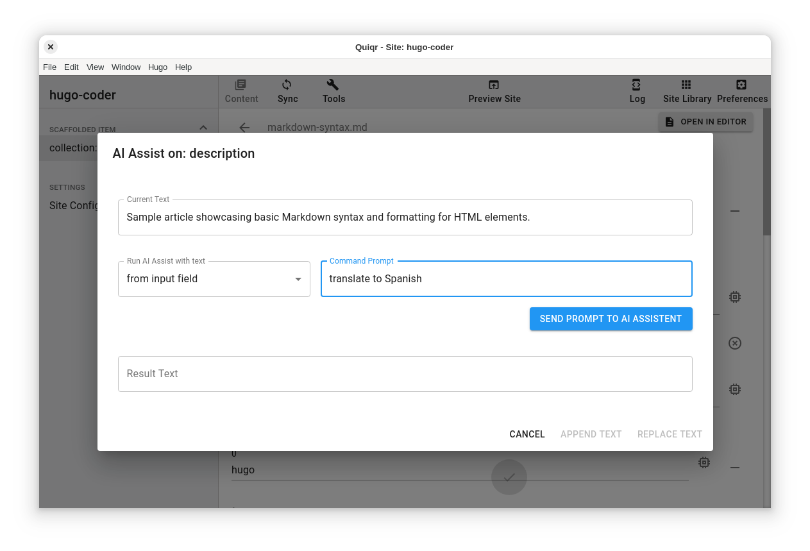

# Advanced Preferences

## Custom open-in-command

The command set is used to open the the current site directory when clicked on
the custom open icon in the Site Toolbox section. See screenshot below.


Variables are replaced before the open command is executed. Available variables are:

- %SITE_PATH
- %SITE_NAME

*tip* you can use the setting below to open the site folder in a tmux shell when a session `quiqr-data` is open.

```
zsh -c "tmux new-window -d -n '%SITE_NAME' -c '%SITE_PATH' -t quiqr-data:"
```

## OpenAI API Key

When set with a valid key, the OpenAI assistant will be activated for every
text field in all Site objects. See example popup below.


